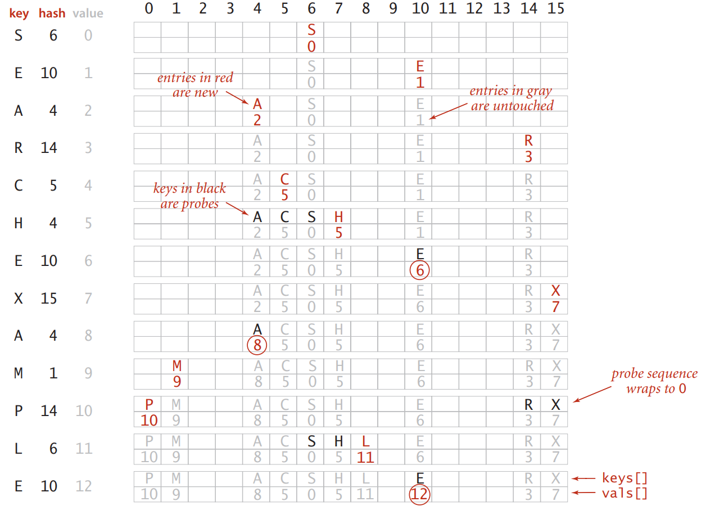
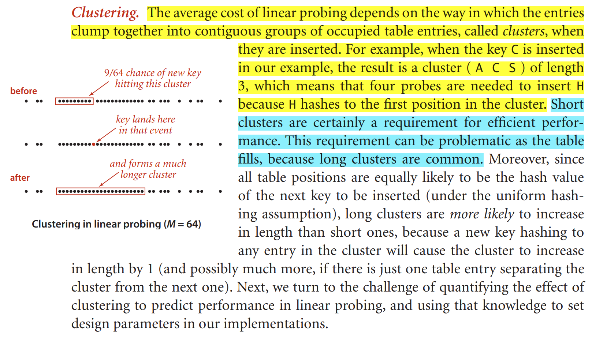

# Hashing

We reference key-value pairs using arrays by doing arithmetic 
operations to transform keys into array indices.

Hashing consists of two separate parts. 
- compute a hash function that transforms the search key into an array index (Hash function).
- collision-resolution process that done if two or more Keys have the same hash.

## Hash functions 

The first problem that we face is the computation of the hash function,
which transforms keys into array indices. If we have an array that can hold
M key-value pairs, then we need a hash function that can transform any given key into
an index into that array: an integer in the range [0, M – 1]. We seek a hash function
that both is easy to compute and uniformly distributes the keys: for each key, every
integer between 0 and M – 1 should be equally likely (independently for every key). 

we need a different hash function for each key type that we use. 

### Positive integers. 
The most commonly used method for hashing integers is called
modular hashing : we choose the array size M to be prime and, 
for any positive integer key k, compute the remainder when dividing k by M. 

### Floating-point numbers. 
If the keys are real numbers between 0 and 1, we might just
multiply by M and round off to the nearest integer to get an index between 0 and M – 1.

### Strings. 
we simply treat them as huge integers. 
so the hash = summition of each character ASCII code.

- so each data type should have it's own hash function.
- some languages like java address that every data type inherits a method called hashCode().

### Software caching. 
If computing the hash code is expensive, it may be worthwhile to
cache the hash for each key. That is, we maintain an instance variable hash in the key
type that contains the value of hashCode() for each key object.

### three primary requirements in implementing a good hash function for a given data type:
- It should be consistent, equal keys must produce the same hash value.
- It should be efficient to compute.
- It should uniformly distribute the keys.

A hash function converts keys into array indices. 
The second component of a hashing algorithm is collision resolution.

## collision resolution: 
a strategy for handling the case when two or more keys to be inserted hash to the same index.

there are Tow main approches:
- Hashing with separate chaining.
- Hashing with linear probing.

### Hashing with separate chaining.
A straightforward and general approach to collision resolution is to build, for each of the
M array indices, a linked list of the key-value pairs whose keys hash to that index. This
method is known as separate chaining because items that collide are chained together
in separate linked lists. 

Table size.
- In a separate-chaining implementation, our goal is to choose the table size M to be sufficiently small that we do not waste a huge area of contiguous memory with empty chains but sufficiently large that we do not waste time searching through long chains. 

### Hashing with linear probing.
Another approach to implementing hashing is to store N key-value pairs 
in a hash table of size M > N, relying on empty entries in the table to help 
with collision resolution. 
Such methods are called open-addressing hashing methods.

when there is a collision 
(when we hash to a table index that is already occupied with a key different from the search key), then we just check the next entry in the table (by incrementing the index). 

when searching for a key in Linear probing.
- Key equal to search key: search hit
- Empty position : search miss
- Key not equal to search key: try next entry

We hash the key to a table index, check whether the search key matches the key there,
and continue (incrementing the index, wrapping back to the beginning of the table
if we reach the end) until finding either the search key or an empty table entry. 

